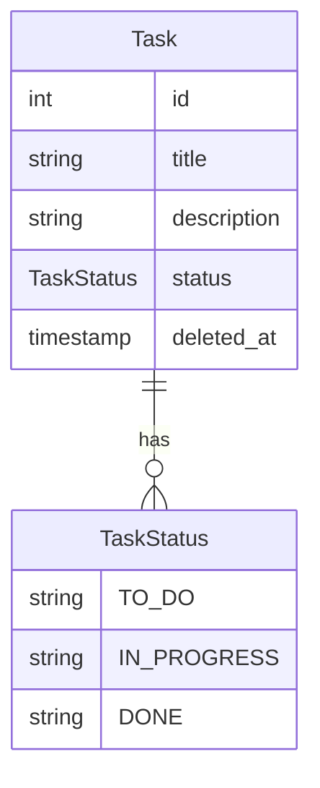

# Task Management API

## Database Schema



## API Endpoints

### Create a Task

```http
POST /v1/tasks
```

### Update a Task Details

```http
PUT /v1/tasks/{id}
```

### Change a Task Status

```http
PATCH /v1/tasks/{id}/status
```

### Remove a Task

```http
DELETE /v1/tasks/{id}
```

### Retrieve a Task by ID

```http
GET /v1/tasks/{id}
```

### List all Tasks

```http
GET /v1/tasks
```

## Project Structure

```bash
.
├── cmd
│   └── main.go # Start the server
├── db
│   ├── migrations # Database migrations
|   |   └── 20210919120000_create_tasks_table.up.sql
|   |   └── 20210919120000_create_tasks_table.down.sql
├── docs
│   └── openapi.yaml # OpenAPI documentation
├── internal
│   ├── configs # Configuration and environment variables
|   ├── domains # for business core domain
|   |   └── task # Task domain
|   |   |   └── infrastructure/repository # managing task repository and database
|   |   |   └── interfaces # task interfaces for the API
|   |   |   └── models # task models for the API
|   |   |   └── usecases # task business logic 
│   ├── entities # Database entities
│   ├── helpers # Helper functions
│   ├── infrastructures # Infrastructure
│   ├── interfaces # Interfaces for the API
│   ├── mocks # Mocks for testing
│   ├── models # Models for the API
```

## Prerequisites

- Go 1.18 compatible with [Go Modules](https://blog.golang.org/using-go-modules)
- PostgreSQL
- Docker (optional, for running the database)
- COPY .env.example to .env and fill in the values (cp .env.example .env)
- Makefile for easy setup (support only macOS)

## Setup

### Environment Variables

Copy the `.env.example` file to `.env` and fill in the values:

```bash
cp .env.example .env
```

### Dependencies

Install the dependencies:

```bash
make install
```

### Database

Start a PostgreSQL database. You can use Docker:

```bash
make docker-dev-up
```

## CURL Commands

### Create a New Task

```bash
curl -X 'POST' \
  'http://localhost:8080/v1/tasks' \
  -H 'accept: application/json' \
  -H 'Content-Type: application/json' \
  -d '{
  "description": "simple task api object",
  "status": "TO_DO",
  "title": "later is never"
}'
```

### Update a Task

```bash
curl -X 'PUT' \
  'http://localhost:8080/v1/tasks/1' \
  -H 'accept: application/json' \
  -H 'Content-Type: application/json' \
  -d '{
  "description": "Coding without coffee is like debugging without a console log.",
  "title": "Code runs, coffee fuels"
}'
```

### Update a Task Status

```bash
curl -X 'PATCH' \
  'http://localhost:8080/v1/tasks/1/status' \
  -H 'accept: application/json' \
  -H 'Content-Type: application/json' \
  -d '{
  "status": "DONE"
}'
```

### Delete a Task

```bash
curl -X 'DELETE' \
  'http://localhost:8080/v1/tasks/1' \
  -H 'accept: application/json'
```

### Get a Task by ID

```bash
curl -X 'GET' \
  'http://localhost:8080/v1/tasks/1' \
  -H 'accept: application/json'
```

### Get all Tasks

```bash
curl -X 'GET' \
  'http://localhost:8080/v1/tasks' \
  -H 'accept: application/json'
```
